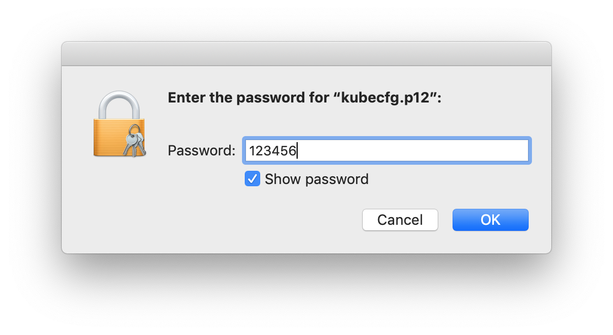

# vagrant-k8s-cluster

Vagrantfile for k8s cluster of 3 node.

## Prerequisite

- Host: Linux
- Vagrant >= 2.0.3 with plugin vagrant-vbguest


## Start

```bash
$ git clone https://github.com/qzchenwl/vagrant-k8s-cluster
$ cd vagrant-k8s-cluster
$ vagrant up
```

## Dashboard

When `vagrant up` succeeded, `kubecfg.p12` and `admin-user-token.txt` can be found in folder `output/`.

Before visiting the dashboard through [api-server](https://10.0.0.101:6443/api/v1/namespaces/kube-system/services/https:kubernetes-dashboard:/proxy/), do the following steps:
1. Trust certificate `output/kubecfg.p12`, which has password `123456`.
   1. Double click `output/kubecfg.p12`
      
   2. Trust *kubernetes-admin* certificate
      
   3. Allow all applications to access this item
      
2. Open url and login
   1. Open chrome and navigate to: `https://10.0.0.101:6443/api/v1/namespaces/kube-system/services/https:kubernetes-dashboard:/proxy/`
   2. Select the certificate
      
   3. Copy admin-user token from `output/admin-user-token.txt`
      
   4. Sign In
      

### Finally

